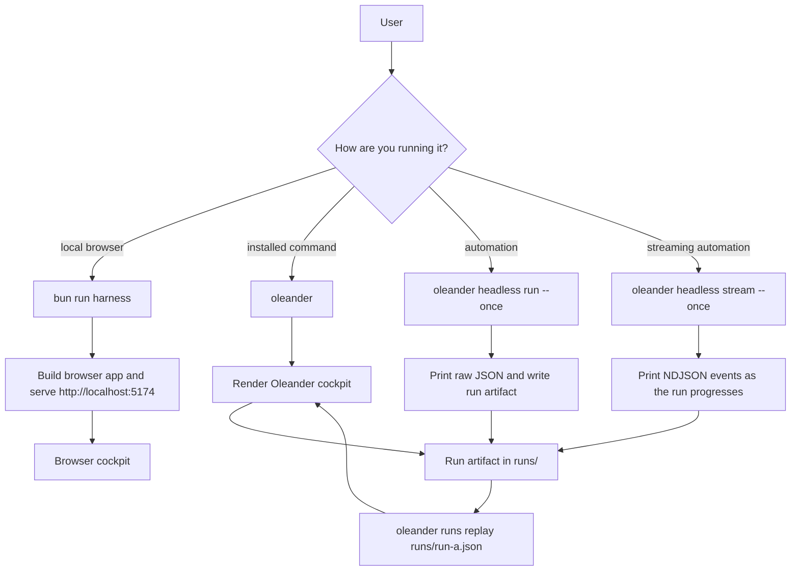
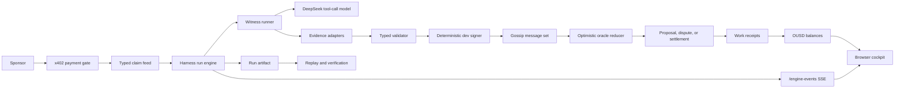

# Oleander

Oleander is an installable, UI-first agentic harness for the ZAP Witness Council.

The harness runs agentic witnesses over typed claim feeds using TypeScript and Effect services. The default `oleander` command opens the cockpit view; `headless` commands are reserved for raw JSON or NDJSON automation. DeepSeek is used through one shared API-key service; the key is read from `DEEPSEEK_API_KEY` or a local key file such as `../deepseek.md`. Set `DEEPSEEK_MOCK=1` to exercise the harness without live model calls.

## Start Here

- [src](src/README.md): CLI entrypoint, shared domain types, and Effect runtime wiring.
- [src/services](src/services/README.md): Witness Council services, oracle reducer, gossip set, evidence adapters, economy receipts, and tests.
- [apps/browser-harness](apps/browser-harness/README.md): D3 browser cockpit for the 50-claim oracle network scenario.
- [claims](claims/README.md): Typed demo claim feed for stablecoin work.
- [docs/x402-witness-economy.md](docs/x402-witness-economy.md): x402 payment/staking plan and mock scenario.
- [docs/production-boundaries.md](docs/production-boundaries.md): mock/dev adapter boundaries and production guardrails.
- [Dockerfile](Dockerfile): Bun container image for witness clients.
- [docker-compose.yml](docker-compose.yml): Local multi-witness harness.
- [docker-compose.x402-mock.yml](docker-compose.x402-mock.yml): Mock x402-funded work scenario.
- [scripts/test-x402-mock.sh](scripts/test-x402-mock.sh): one-command sponsor/oracle incentive run over 10 mock claims.
- [.env.example](.env.example): Runtime config surface.

## Commands

Fast local browser run:

```bash
bun install
bun run harness
```

Open `http://localhost:5174`. The app builds first, then serves the browser cockpit and streams engine events into it.

Install and run the `oleander` command:

```bash
bun run build
npm link
oleander
oleander --once
oleander runs replay runs/run-a.json
oleander headless run --once
oleander headless stream --once
```

Development checks:

```bash
bun run ci
bun run typecheck
bun run browser:typecheck
bun test
```

Useful local commands:

```bash
bun run dev -- claims list
bun run dev -- deepseek smoke
bun run dev -- harness serve
bun run dev -- runs replay runs/run-a.json
bun run dev -- x402 scenario
bun run dev -- x402 work --once
```

Docker paths:

```bash
docker compose up --build
docker compose --profile workers up --build
./scripts/test-x402-mock.sh
```

## Run Paths



The default product surface is the Oleander UI. Use `oleander --once` for a one-shot cockpit render, `oleander runs replay <file>` to reopen a saved run in the cockpit, `oleander headless run --once` when you need raw event JSON without the UI, and `oleander headless stream --once` when automation needs newline-delimited events as the run progresses.

Browser harness:

```bash
bun run harness
```

Open `http://localhost:5174`. The CLI serves the D3 harness and the browser opens `/engine-events?regime=<selected>` first, using the same shared event spine as headless runs, artifacts, replay, OUSD budget accounting, and the local run engine. The legacy `/events` stream remains as a browser compatibility fallback. The browser shows claim routing, witness/tool activity, receipts, sponsor funded OUSD, sponsor remaining OUSD, and witness OUSD earnings. The browser auto-scans every 3 minutes by default. Use `ZAP_HARNESS_PORT`, `ZAP_HARNESS_EVENT_DELAY_MS`, or `ZAP_HARNESS_AUTO_RUN_MS` to change the local port, stream speed, or scan cadence.

The x402 compose file mirrors the Paybot shape: a facilitator accepts payment
creation, verification, and settlement calls; a protected resource server
returns `402 Payment Required` until a witness supplies the mock `X-PAYMENT`
header; council clients then fetch the paid claim feed and process work.

Run artifacts are written to `runs/` by default for `x402 work --once`, UI runs, and headless harness runs. The CLI prints the artifact path on stderr so stdout can remain either cockpit text or raw JSON. Set `ZAP_RUN_ARTIFACT_DIR` to write artifacts elsewhere. Use `oleander runs replay <file>` for cockpit replay and `oleander headless runs verify <file>` for non-UI validation.

## Architecture



The important rule: gossip converges signed evidence, the DeepSeek tool-call witness gathers and critiques evidence, the validator enforces typed boundaries, and the oracle reducer derives proposal/dispute/settlement state. OUSD balance events come from the same engine stream that powers the browser, headless runs, artifacts, and replay.

## Council Roles

```text
High Witness      protocol architecture
Law Witness       claim schemas
Cut Witness       deterministic validation
Signal Witness    gossip / CRDT readiness
Forge Witness     runtime packaging
Fault Witness     adversarial validation
Research Witness  DeepSeek tool-call witness evidence work
Gate Witness      admission control
```

## Boundary

DeepSeek can help each witness analyze claims and produce structured observations. The protocol boundary still lives in typed claim validation, signed observations, explicit disputes, and deterministic reducers.

## Signing Boundary

The current signer is a deterministic development signer scoped by `ZAP_NODE_ID`. It is suitable for local harness work and reproducible tests. Production signing should replace `SignerLive` behind the same Effect service boundary with wallet, KMS, or node-key signing; observation payload shape should remain canonical so signatures stay auditable.

## Witness Economy Boundary

OUSD pays for completed oracle work. ZAP accounts for utility, staking, reputation, amplification, and council-governed incentives. Rewards must derive from verifiable work receipts such as signed observations, valid disputes, availability proofs, or quality/amplification receipts. The Council governs incentive policy; typed claims and the oracle reducer govern truth.

## Current Capstone Slice

The current repo proves the local client harness:

- Bun + Effect TS CLI
- DeepSeek Pro council activity check
- typed claim feed and validator
- DeepSeek tool-call witness observation runtime
- normalized evidence adapters
- deterministic dev signing
- append-only gossip/CRDT-style message set
- optimistic oracle reducer
- scheduled witness loop
- adversarial validation suite

Run `bun test` for the fastest confidence check.
